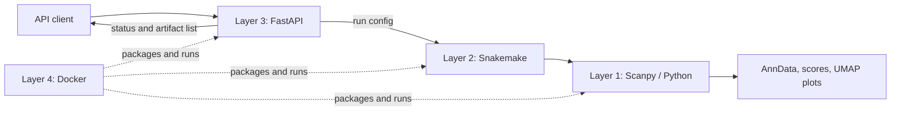

# project_annotation

A reproducible single-cell annotation service built with Scanpy, Snakemake,
FastAPI, and Docker.

## Architecture



- Layer 1 — scientific calculation: testable functions in
  `src/scrna_pipeline/` implement cohort selection, QC, preprocessing,
  integration, clustering, annotation, validation, and visualization.
- Layer 2 — workflow: `Snakefile` and `workflow/` connect calculation steps
  into a resumable DAG.
- Layer 3 — service interface: `api/main.py` validates requests, creates an
  isolated run configuration, starts Snakemake, and exposes status/results.
- Layer 4 — runtime: `Dockerfile` packages the API, workflow, and scientific
  dependencies into one non-root container.

Each API request writes only beneath `runs/<run_id>/`:

```text
runs/<run_id>/
├── config.yaml
├── status.json
├── snakemake.log
├── logs/
└── results/<cohort>/
    ├── annotated.h5ad
    ├── cluster_scores.csv
    └── plots/
```

The current API executes jobs as FastAPI background tasks and stores state on
the local filesystem. For multi-host or high-throughput deployment, replace
these pieces with a durable task queue and shared object storage.

## Data contract

The input is an AnnData `.h5ad` containing raw counts in `.X` and required
`obs` columns `sample` and `batch`. Columns referenced by
`cohort.filters` in `config/config.yaml` must also exist.

The annotated output contains:

- `obs`: `celltype`, `celltype_confidence`, `annotation_source`, and
  `annotation_version`.
- `uns`: `celltype_colors` and `annotation_metadata`.

## Workflow

`input.h5ad → cohort → QC → preprocess → integrate → reduce/cluster → annotate → visualize`

## Run with Docker

Put the input at `data/raw/input.h5ad` and ensure its metadata matches the
filters in `config/config.yaml`.

```bash
docker build -t project-annotation .
docker run --rm -p 8000:8000 \
  -v "$PWD/data:/app/data:ro" \
  -v "$PWD/runs:/app/runs" \
  project-annotation
```

The OpenAPI UI is available at <http://localhost:8000/docs>.

## Minimal API usage

Check health:

```bash
curl http://localhost:8000/health
```

Start an analysis:

```bash
curl -X POST http://localhost:8000/analysis \
  -H 'Content-Type: application/json' \
  -d '{
    "cohort": "ven_prepost",
    "n_hvg": 2000,
    "n_neighbors": 15,
    "resolution": 0.8
  }'
```

The response contains a run ID:

```json
{"run_id":"<run-id>","status":"received"}
```

Poll the run and list completed artifacts:

```bash
curl http://localhost:8000/analysis/<run-id>
curl http://localhost:8000/analysis/<run-id>/results
```

Status progresses through `received → running → completed`, or ends at
`failed`. Detailed output is stored in `runs/<run-id>/snakemake.log`.

## Local development

```bash
python -m pip install -e '.[workflow,api,test]'
uvicorn api.main:app --reload
pytest
```

Run or validate the workflow directly:

```bash
snakemake --cores 1
snakemake --dry-run --cores 1
```
